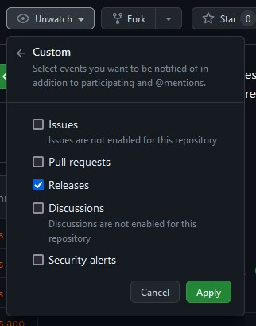

# MKVToolNix Mirror

This repository mirrors the official upstream repository on GitLab at [gitlab.com/mbunkus/mkvtoolnix](https://gitlab.com/mbunkus/mkvtoolnix).

You can watch releases to be notified of new releases.

The release will have the version changes in its description.

For the latest release, see [releases/latest](releases/latest).

Note that downloads are not provided. Please refer to [the official MKVToolNix website downloads](https://mkvtoolnix.download/downloads.html) or your package manager of choice.

## Intention

The official source repository on GitLab has shortcomings:

* Does not publish / create releases you can subscribe to
* Does not make release notes (changes in new versions) easily accessible

This repository provides both; publishes releases you can be notified of, and includes version release notes.

## Upstream Information

* Upstream Website: <https://mkvtoolnix.download/>
* Upstream Repository: <https://gitlab.com/mbunkus/mkvtoolnix>
* Upstream MXE build tools Repository: <https://gitlab.com/mbunkus/mxe>

Upstream Repository layout:

* Single Branch: `main`
* Release Tags: `release-*` (`77.0`, `75.0.0`)
